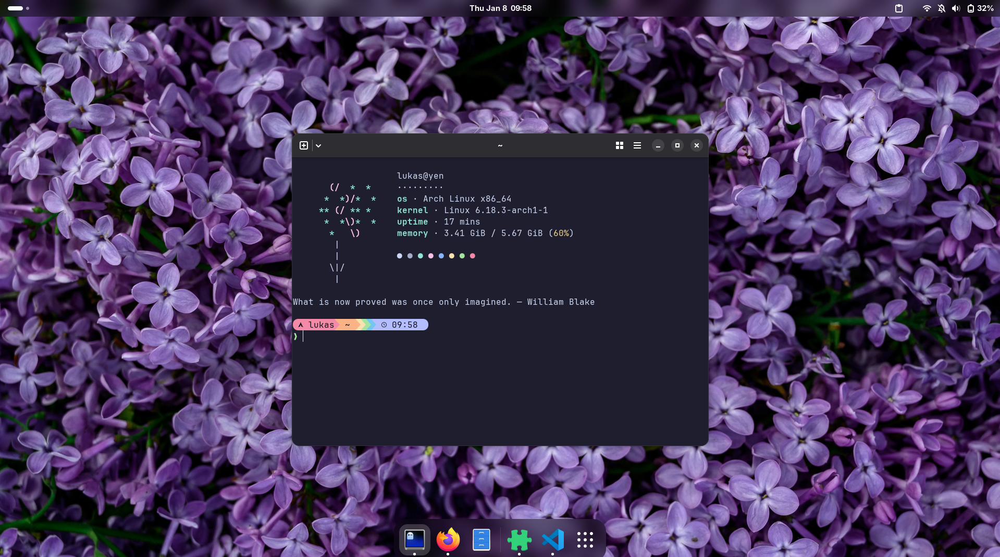

# dotfiles

## GNOME Extensions

- [Blur my Shell](https://extensions.gnome.org/extension/3193/blur-my-shell/)
- [Caffeine](https://extensions.gnome.org/extension/517/caffeine/)
- [Clipboard Indicator](https://extensions.gnome.org/extension/779/clipboard-indicator/)
- [Dash to Dock](https://extensions.gnome.org/extension/307/dash-to-dock/)

## Theme

- [Catppuccin for VSCode](https://marketplace.visualstudio.com/items?itemName=Catppuccin.catppuccin-vsc)
- [Catppuccin for Firefox](https://github.com/catppuccin/firefox)

## Font

- [JetBrains Mono Nerd Font](https://www.nerdfonts.com/font-downloads)
